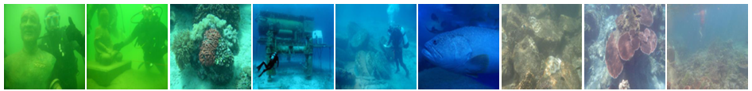

## Dataset-检测、分类

| 【[URPC2017](#URPC2017)】                 | **【[百度网盘](https://pan.baidu.com/s/1FUyOttj-FxtyoRftNb4fsw?pwd=vowy)】** |                       **【官方下载】**                       | **【Paper】**                                                |                    **【Github】**                     |                       **【Homepage】**                       |
| :---------------------------------------- | :----------------------------------------------------------: | :----------------------------------------------------------: | ------------------------------------------------------------ | :---------------------------------------------------: | :----------------------------------------------------------: |
| **【[URPC2018](#URPC2018)】**             | **【[百度网盘](https://pan.baidu.com/s/1aDR6ldk1aU41QEhH1Vp-FA?pwd=hyyk)】** |                       **【官方下载】**                       | **【Paper】**                                                |                    **【Github】**                     |                       **【Homepage】**                       |
| **【[URPC2019](#URPC2019)】**             | **【[百度网盘](https://pan.baidu.com/s/1ZBGWP_OGHjEhagLy4eL3OQ?pwd=t2dq )】** |                       **【官方下载】**                       | **【Paper】**                                                |                    **【Github】**                     |                       **【Homepage】**                       |
| **【[S-URPC2019](#S-URPC2019)】**         | **【[百度网盘](https://pan.baidu.com/s/1D1X5tF2qhuRYaFm9-r4uPg?pwd=wjbu )】** |   **【[官方下载](https://github.com/mousecpn/DG-YOLO)】**    | **【[Paper](https://arxiv.org/abs/2004.06333)】**            | **【[Github](https://github.com/mousecpn/DG-YOLO)】** |                       **【Homepage】**                       |
| **【[URPC2020ZJ](#URPC2020ZJ)】**         | **【[百度网盘](https://pan.baidu.com/s/1pgJnPkagB8IREK9dFHJSEg?pwd=l4d5)】** |                       **【官方下载】**                       | **【Paper】**                                                |                    **【Github】**                     |                       **【Homepage】**                       |
| **【[URPC2020DL](#URPC2020DL)】**         | **【[百度网盘](https://pan.baidu.com/s/1-9W0C0sdkjo4FSH7BTGb0A?pwd=7zae )】** |                       **【官方下载】**                       | **【Paper】**                                                |                    **【Github】**                     |                       **【Homepage】**                       |
| **【[UDD](#UDD)】**                       |                       **【百度网盘】**                       |                       **【官方下载】**                       | **【Paper】**                                                |                    **【Github】**                     |                       **【Homepage】**                       |
| **【[DUO](#DUO)】**                       | **【[百度网盘](https://pan.baidu.com/s/1BUF7ZY9VxM4jbgFLU59Nww?pwd=9wtj )】** |    **【[官方下载](https://github.com/chongweiliu/DUO)】**    | **【[Paper](https://ieeexplore.ieee.org/document/9455997)】** | **【[Github](https://github.com/chongweiliu/DUO)】**  |                       **【Homepage】**                       |
| **【[UODD](#UODD)】**                     | **【[百度网盘](https://pan.baidu.com/s/1-3IDIi-fd5gGEbv9BTCyjQ?pwd=ufsm)】** | **【[官方下载](https://github.com/LehiChiang/Underwater-object-detection-dataset)】** | **【[Paper](https://www.researchgate.net/publication/355375809_Underwater_Species_Detection_using_Channel_Sharpening_Attention)】** |                    **【Github】**                     |                       **【Homepage】**                       |
| **【[UTDAC2020](#UTDAC2020)】**           | **【[百度网盘](https://pan.baidu.com/s/1WQejN252Hz32C_PDSLjanA?pwd=4tod)】** | **【[官方下载](https://github.com/mousecpn/Boosting-R-CNN-Reweighting-R-CNN-Samples-by-RPN-s-Error-for-Underwater-Object-Detection)】** | **【Paper】**                                                |                    **【Github】**                     |                       **【Homepage】**                       |
| **【[S_UTDAC2020](#S_UTDAC2020)】**       | 【[百度网盘](https://pan.baidu.com/s/1aEQgfaeloxxxeNJ0BG2Q-w?pwd=d89u)】 | 【[官方下载](https://github.com/mousecpn/DMC-Domain-Generalization-for-Underwater-Object-Detection)】 | 【**[Paper](https://arxiv.org/abs/2104.02230)**】            |                                                       |                                                              |
| **【[Fish4Knowledge](#Fish4Knowledge)】** | **【[百度网盘](https://pan.baidu.com/s/1sAsS8JcGPDa6uU75xpp7mg?pwd=hubu)】** | **【[官方下载](https://universe.roboflow.com/g18l5754/fish4knowledge-dataset/dataset/3)】** | **【Paper】**                                                |                    **【Github】**                     | **【[Homepage](https://universe.roboflow.com/g18l5754/fish4knowledge-dataset)】** |

## Dataset-分割、深度、显著性

| **【[SUIM](#SUIM)】**         | **【[百度网盘](https://pan.baidu.com/s/1lFLY7ykHXnuGumBDeckA7Q?pwd=cgvc )】** | **【[官方下载](https://drive.google.com/drive/folders/10KMK0rNB43V2g30NcA1RYipL535DuZ-h)】** | **【[Paper](https://ieeexplore.ieee.org/document/9340821/)】** |   **【[Github](https://github.com/xahidbuffon/SUIM)】**    | **【[Homepage](https://irvlab.cs.umn.edu/resources/suim-dataset)】** |
| :---------------------------- | :----------------------------------------------------------: | :----------------------------------------------------------: | :----------------------------------------------------------: | :--------------------------------------------------------: | :----------------------------------------------------------: |
| **【[SUIM-E](#SUIM-E)】**     | **【[百度网盘](https://pan.baidu.com/s/1DJAFKew7po8FMUrS9P7oOw?pwd=qc1j)】** |    **【[官方下载](https://github.com/trentqq/SUIM-E)】**     |                        **【Paper】**                         |    **【[Github](https://github.com/trentqq/SUIM-E)】**     |                       **【Homepage】**                       |
| **【[UIEBD](#UIEBD)】**       | **【[百度网盘](https://pan.baidu.com/s/1YbtAGyKyF5wT-zLEVj8tBg?pwd=ubd3)】** |                       **【官方下载】**                       |    **【[Paper](https://arxiv.org/pdf/1901.05495.pdf)】**     |                       **【Github】**                       |                                                              |
| **【[DUT-USEG](#DUT-USEG)】** | **【[百度网盘](https://pan.baidu.com/s/1SaruYKrjtrj1N4JWba71kA?pwd=fnqz)】** |    **【[官方下载](https://github.com/baxiyi/dut-useg)】**    |      **【[Paper](https://arxiv.org/abs/2108.11727)】**       |    **【[Github](https://github.com/baxiyi/dut-useg)】**    |                                                              |
| **【[MAS3K](#MAS3K)】**       | **【[百度网盘](https://pan.baidu.com/s/1m07khNnvPe_-tsQX2Tyl2g?pwd=tff1)】** |     **【[官方下载](https://github.com/LinLi-DL/MAS)】**      | **【[Paper](https://link.springer.com/chapter/10.1007/978-3-030-71058-3_12)】** |                       **【Github】**                       |                       **【Homepage】**                       |
| **【[USOD10K](#USOD10K)】**   | **【[百度网盘](https://pan.baidu.com/s/1quchWfk3L8uzCCqfKaKFIQ?pwd=0rfc)】** | **【[官方下载](https://drive.google.com/file/d/1PH0PwKchXnkWwtAwbhNSW4utMCp5zer8/view)】** | **【[Paper](https://ieeexplore.ieee.org/document/10102831)】** |  **【[Github](https://github.com/LinHong-HIT/USOD10K)】**  |                       **【Homepage】**                       |
| **【[LIACI](#LIACI)】**       | **【[百度网盘](https://pan.baidu.com/s/1xhKKI9L6XXH7IIzH8Zgqzg?pwd=7196)】** |       **【[官方下载](https://liaci.sintef.cloud/)】**        |                        **【Paper】**                         |                       **【Github】**                       |                       **【Homepage】**                       |
| **【[UFO-120](#UFO-120)】**   | **【[百度网盘](https://pan.baidu.com/s/16Rrp98LCCjPoDvnzhpVP3w?pwd=9vwa)】** | **【[官方下载](https://irvlab.cs.umn.edu/resources/ufo-120-dataset)】** | **【[Paper](http://www.roboticsproceedings.org/rss16/p018.pdf)】** | **【[Github](https://github.com/xahidbuffon/Deep_SESR)】** |                       **【Homepage】**                       |
| **【[Sea-thru](#Sea-thru)】** | **【[百度网盘](https://pan.baidu.com/s/1UYUHfE_OiqJdU6YCZpssJg?pwd=g344)】** | **【[官方下载](https://csms.haifa.ac.il/profiles/tTreibitz/datasets/sea_thru/index.html)】** | **【[Paper](http://csms.haifa.ac.il/profiles/tTreibitz/webfiles/sea-thru_cvpr2019.pdf)】** |                       **【Github】**                       | **【[Homepage](https://csms.haifa.ac.il/profiles/tTreibitz/datasets/sea_thru/index.html)】** |
| **【[TrashCan](#TrashCan)】** | **【[百度网盘](https://pan.baidu.com/s/1e0uceGuOSVjaD5SKwLFMOQ?pwd=h9ml)】** | **【[官方下载](https://conservancy.umn.edu/handle/11299/214865)】** |      **【[Paper](https://arxiv.org/abs/2007.08097)】**       |                       **【Github】**                       | **【[Homepage](https://conservancy.umn.edu/handle/11299/214865)】** |

## Dataset-增强

| 【[EUVP](#EUVP)】               | **【[百度网盘](https://pan.baidu.com/s/12ncPRE3sVgSHRjcZI_j54Q?pwd=8dar)】** | **【[官方下载](https://irvlab.cs.umn.edu/resources/euvp-dataset)】** | **【[Paper](https://ieeexplore.ieee.org/document/9001231)】** |  **【[Github](https://github.com/xahidbuffon/FUnIE-GAN)】**  |                                                              |
| :------------------------------ | :----------------------------------------------------------: | :----------------------------------------------------------: | :----------------------------------------------------------: | :----------------------------------------------------------: | :----------------------------------------------------------: |
| **【[UIEB](#UIEB)】**           | **【[百度网盘](https://pan.baidu.com/s/1vzzGbl6UXDuMHGqn5SZ5tg?pwd=72ob)】** | **【[官方下载](https://li-chongyi.github.io/proj_benchmark.html)】** | **【[Paper](https://ieeexplore.ieee.org/document/8917818)】** |                        **【Github】**                        | **【[Homepage](https://li-chongyi.github.io/proj_benchmark.html)】** |
| **【[RUIE](#RUIE)】**           | **【[百度网盘](https://pan.baidu.com/s/1WpyYaWamJZGJ5ItQ1k11TA?pwd=878i )】** | **【[官方下载](https://github.com/dlut-dimt/Realworld-Underwater-Image-Enhancement-RUIE-Benchmark)】** | **【[Paper](https://ieeexplore.ieee.org/document/8949763)】** |                        **【Github】**                        |                                                              |
| **【[OceanDark](#OceanDark)】** | **【[百度网盘](https://pan.baidu.com/s/1bbHVY_SJ_CfKs3D7eykTTw?pwd=bguh)】** | **【[官方下载](https://sites.google.com/view/oceandark)】**  |   **【[Paper](https://www.mdpi.com/2313-433X/5/10/79)】**    |       **【[Github](https://github.com/tunai/l2uwe)】**       |                                                              |
| **【[U-45](#U-45)】**           | **【[百度网盘](https://pan.baidu.com/s/19Qa1spbMTkcSRLL_KcvR1A?pwd=41gd)】** | **【[官方下载](https://github.com/IPNUISTlegal/underwater-test-dataset-U45-)】** |      **【[Paper](https://arxiv.org/abs/1906.06819)】**       |                        **【Github】**                        |                                                              |
| **【[WaterGAN](#WaterGAN)】**   | **【[百度网盘](https://pan.baidu.com/s/18npTwOvADQ7zybJ3O3fzDQ?pwd=xn8g)】** |      **【[官方下载](https://github.com/kskin/data)】**       |      **【[Paper](https://arxiv.org/abs/1702.07392)】**       |     **【[Github](https://github.com/kskin/WaterGAN/)】**     |                                                              |
| **【[SUIM-E](#SUIM-E)】**       | **【[百度网盘](https://pan.baidu.com/s/1DJAFKew7po8FMUrS9P7oOw?pwd=qc1j)】** |    **【[官方下载](https://github.com/trentqq/SUIM-E)】**     |                        **【Paper】**                         |     **【[Github](https://github.com/trentqq/SUIM-E)】**      |                       **【Homepage】**                       |
| **【[SQUID](#SQUID)】**         | **【[百度网盘](https://pan.baidu.com/s/1JLijb0bhiIGN4P99ZunY_A?pwd=1ktp)】** | **【[官方下载](https://csms.haifa.ac.il/profiles/tTreibitz/datasets/ambient_forwardlooking/index.html)】** |      **【[Paper](https://arxiv.org/abs/1811.01343)】**       | **【[Github](https://github.com/danaberman/underwater-hl)】** |                                                              |
| **【[TURBID](#TURBID)】**       | **【[百度网盘](https://pan.baidu.com/s/1FlA7uACDVGDYfg7oAOXe_Q?pwd=otol )】** |    **【[官方下载](http://amandaduarte.com.br/turbid/)】**    | **【[Paper](https://ieeexplore.ieee.org/abstract/document/7485524)】** |                        **【Github】**                        |                                                              |

## Dataset-其他

| 【[FishNet](#FishNet)】           | 【[百度网盘](https://pan.baidu.com/s/1COs0i-7aXK-S00ZgFRVRlQ?pwd=3u7a)】 | 【[官方下载](https://drive.google.com/file/d/1mqLoap9QIVGYaPJ7T_KSBfLxJOg2yFY3/view)】 | 【[Paper](https://openaccess.thecvf.com//content/ICCV2023/html/Khan_FishNet_A_Large-scale_Dataset_and_Benchmark_for_Fish_Recognition_Detection_ICCV_2023_paper.html)】 | 【[Github](https://github.com/faixan-khan/FishNet/)】        | 【[Homepage](https://fishnet-2023.github.io/)】 |
| --------------------------------- | ------------------------------------------------------------ | ------------------------------------------------------------ | ------------------------------------------------------------ | ------------------------------------------------------------ | ----------------------------------------------- |
| **【[UWA-CIRset](#UWA-CIRset)】** | **【[百度网盘](https://pan.baidu.com/s/1Vg8aFvjxJF0uUo5CvZe1ZQ?pwd=upf2)】** | **【[官方下载](https://github.com/haozhao10/Underwater-acoustic-channel-dataset/)】** | **【Paper】**                                                | **【[Github](https://github.com/haozhao10/Underwater-acoustic-channel-dataset/)】** | **【Homepage】**                                |

## Dataset Detail

<h3 id="URPC2017">URPC2017</h3>

- 17655张训练，985张测试，分辨率720x405.
- 所有图像均取自6个视频，间隔为10帧
- 所有的视频都是在人工模拟的环境中拍摄，因此同一个视频中的图片几乎完全一样

<h3 id="URPC2018">URPC2018</h3>

- 2901张训练，800张测试；分辨率有586x480, 704x576， 720x405, 1920x1080
- 测试集没有annotations
- 有一些图像来自人工的水下环境

<h3 id="URPC2019">URPC2019</h3>

- 4757张训练，1029张测试，最高分辨率为3840x2160
- Five categories: echinus,starfish,holothurian,scallopandwaterweeds
- 测试集没有annotations

<h3 id="S-URPC2019">S-URPC2019</h3>

- Four classes: echinus, holothurian, scallop, starfish, waterweed

<h3 id="URPC2020ZJ">URPC2020ZJ</h3>

- 5543张训练，2000张测试，最高分辨率为3840x2160
- 测试集没有annotations

<h3 id="URPC2020DL">URPC2020DL</h3>

- 6575张训练，2400张测试，最高分辨率为3840x2160
- 测试集没有annotations

<h3 id="UDD">UDD</h3>

- 1827张训练，400张测试，最高分辨率为3840x2160

<h3 id="DUO">DUO</h3>

- 6641张训练，1111张测试，总的目标数有74515.

<h3 id="UODD">UODD</h3>

- 2560张训练，128张验证、506张测试
- Four classes: echinus, holothurian, scallop, starfish

<h3 id="UTDAC2020">UTDAC2020</h3>

- 5168训练、1293验证
- 四种分辨率：3840×2160, 1920×1080,720×405,and 586×480.
- Four classes: echinus, holothurian, scallop, starfish

<h3 id="S_UTDAC2020">S_UTDAC2020</h3>

- Four classes: echinus, holothurian, scallop, starfish

<h3 id="Fish4Knowledge">Fish4Knowledge</h3>

<h3 id="SUIM">SUIM</h3>

<h3 id="DUT-USEG">DUT-USEG</h3>

- includes 6617 images, 1487 of which have semantic segmentation and instance segmentation annotations, and the remaining 5130 images have object detection box annotations.

<h3 id="MAS3K">MAS3K</h3>

- the first open Marine Animal Segmentation dataset, called MAS3K 
- contains a total of 3,103 images, where 1,588 are for camouflaged cases, 1,322 are for common cases, and 193 are underwater images in absence of marine animals
- cover both vertebrate and invertebrate, including seven super-classes, e.g., mammals, reptile, arthropod, and
  marine fish, etc. Under the super-classes, MAS3K dataset has 37 sub-classes,e.g., crab, starfish, shark, and turtle, etc.

<h3 id="USOD10K">USOD10K</h3>

- It consists of 10,255 underwater images, covering 70 categories of salient objects in 12 different underwater scenes.

<h3 id="LIACI">LIACI</h3>

- 首个公开的用于水下船舶检查的大规模语义分割数据集，包含1893张带有像素注释的图像

<h3 id="UIEBD">UIEBD</h3>

- 100 images

<h3 id="UFO-120">UFO-120</h3>

- **train_val/** contains 1500 paired samples for training/validation
- **TEST/** contains 120 paired samples for benchmark evaluation

<h3 id="Sea-thru">Sea-thru</h3>

<h3 id="TrashCan">TrashCan</h3>

<h3 id="UWA-CIRset">UWA-CIRset</h3>

<h3 id="EUVP">EUVP</h3>

<h3 id="UIEB">UIEB</h3>

<h3 id="SUIM-E">SUIM-E</h3>

<h3 id="RUIE">RUIE</h3>

<h3 id="OceanDark">OceanDark</h3>

- 183张1280 x 720像素，由位于深海的摄像机使用人工照明拍摄

<h3 id="U-45">U-45</h3>

- 45 real underwater images

<h3 id="SQUID">SQUID</h3>

<h3 id="TURBID">TURBID</h3>

 

