# Underwater Image Datasets Collection

本项目整理了水下图像相关常用数据集，涵盖数据集的基本信息、发表年份、期刊/会议、论文链接、官方下载链接、相关 GitHub 项目以及个人补充下载方式等内容。

项目旨在帮助研究者快速了解各类水下图像数据集的内容、特点与适用任务，便于进行数据集调研、任务选型与实验准备。

> 注：本仓库仅对公开信息进行整理与汇总，不拥有相关数据集的版权，具体使用方式请以原始发布方说明为准。

## Dataset-检测、分类

| 2017 |                | 【[URPC2017](#URPC2017)】                 | **【[百度网盘](https://pan.baidu.com/s/1FUyOttj-FxtyoRftNb4fsw?pwd=vowy)】** |                       **【官方下载】**                       |                        **【Paper】**                         |                        **【Github】**                        |                       **【Homepage】**                       |
| ---- | -------------- | :---------------------------------------- | :----------------------------------------------------------: | :----------------------------------------------------------: | :----------------------------------------------------------: | :----------------------------------------------------------: | :----------------------------------------------------------: |
| 2018 |                | **【[URPC2018](#URPC2018)】**             | **【[百度网盘](https://pan.baidu.com/s/1aDR6ldk1aU41QEhH1Vp-FA?pwd=hyyk)】** |                       **【官方下载】**                       |                        **【Paper】**                         |                        **【Github】**                        |                       **【Homepage】**                       |
| 2019 |                | **【[URPC2019](#URPC2019)】**             | **【[百度网盘](https://pan.baidu.com/s/1ZBGWP_OGHjEhagLy4eL3OQ?pwd=t2dq)】** |                       **【官方下载】**                       |                        **【Paper】**                         |                        **【Github】**                        |                       **【Homepage】**                       |
| 2019 |                | **【[S-URPC2019](#S-URPC2019)】**         | **【[百度网盘](https://pan.baidu.com/s/1D1X5tF2qhuRYaFm9-r4uPg?pwd=wjbu)】** |   **【[官方下载](https://github.com/mousecpn/DG-YOLO)】**    |      **【[Paper](https://arxiv.org/abs/2004.06333)】**       |    **【[Github](https://github.com/mousecpn/DG-YOLO)】**     |                       **【Homepage】**                       |
| 2020 |                | **【[URPC2020ZJ](#URPC2020ZJ)】**         | **【[百度网盘](https://pan.baidu.com/s/1pgJnPkagB8IREK9dFHJSEg?pwd=l4d5)】** |                       **【官方下载】**                       |                        **【Paper】**                         |                        **【Github】**                        |                       **【Homepage】**                       |
| 2020 |                | **【[URPC2020DL](#URPC2020DL)】**         | **【[百度网盘](https://pan.baidu.com/s/1-9W0C0sdkjo4FSH7BTGb0A?pwd=7zae)】** |                       **【官方下载】**                       |                        **【Paper】**                         |                        **【Github】**                        |                       **【Homepage】**                       |
| 2022 | TCSVT          | **【[UDD](#UDD)】**                       |                       **【百度网盘】**                       | **【[官方下载](https://drive.google.com/drive/folders/1vPc7bIeMR-zG1pgXP3NJSlFEiZbwgjH4?usp=sharing)】** | **【[Paper](https://ieeexplore.ieee.org/document/9496608)】** | **【[Github](https://github.com/chongweiliu/UDD_Official)】** |                       **【Homepage】**                       |
| 2021 | ICMEW          | **【[DUO](#DUO)】**                       | **【[百度网盘](https://pan.baidu.com/s/1BUF7ZY9VxM4jbgFLU59Nww?pwd=9wtj)】** |    **【[官方下载](https://github.com/chongweiliu/DUO)】**    | **【[Paper](https://ieeexplore.ieee.org/document/9455997)】** |     **【[Github](https://github.com/chongweiliu/DUO)】**     |                       **【Homepage】**                       |
| 2021 | MM             | **【[UODD](#UODD)】**                     | **【[百度网盘](https://pan.baidu.com/s/1-3IDIi-fd5gGEbv9BTCyjQ?pwd=ufsm)】** | **【[官方下载](https://github.com/LehiChiang/Underwater-object-detection-dataset)】** | **【[Paper](https://dl.acm.org/doi/10.1145/3474085.3475563)】** |                        **【Github】**                        |                       **【Homepage】**                       |
| 2020 |                | **【[UTDAC2020](#UTDAC2020)】**           | **【[百度网盘](https://pan.baidu.com/s/1WQejN252Hz32C_PDSLjanA?pwd=4tod)】** | **【[官方下载](https://github.com/mousecpn/Boosting-R-CNN-Reweighting-R-CNN-Samples-by-RPN-s-Error-for-Underwater-Object-Detection)】** |                        **【Paper】**                         |                        **【Github】**                        |                       **【Homepage】**                       |
| 2020 |                | **【[S_UTDAC2020](#S_UTDAC2020)】**       | **【[百度网盘](https://pan.baidu.com/s/1aEQgfaeloxxxeNJ0BG2Q-w?pwd=d89u)】** | **【[官方下载](https://github.com/mousecpn/DMC-Domain-Generalization-for-Underwater-Object-Detection)】** |      【**[Paper](https://arxiv.org/abs/2104.02230)**】       |                                                              |                                                              |
| 2022 | Neurocomputing | **【[RUOD](#RUOD)】**                     | **【[百度网盘](https://pan.baidu.com/s/1s2UUnssistBqcNZP2I0VTg?pwd=ymal)】** |                       **【官方下载】**                       | **【[Paper](https://dl.acm.org/doi/10.1016/j.neucom.2022.10.039)】** |     **【[Github](https://github.com/dlut-dimt/RUOD)】**      |                       **【Homepage】**                       |
|      |                | **【[Fish4Knowledge](#Fish4Knowledge)】** | **【[百度网盘](https://pan.baidu.com/s/1sAsS8JcGPDa6uU75xpp7mg?pwd=hubu)】** | **【[官方下载](https://universe.roboflow.com/g18l5754/fish4knowledge-dataset/dataset/3)】** |                        **【Paper】**                         |                        **【Github】**                        | **【[Homepage](https://universe.roboflow.com/g18l5754/fish4knowledge-dataset)】** |
|      |                | **【[FishNet](#FishNet)】**               | **【[百度网盘](https://pan.baidu.com/s/1AJIk6n3g0KDgnPrSC3hk9Q?pwd=jsyz)】** |                       **【官方下载】**                       |                        **【Paper】**                         |                        **【Github】**                        |                       **【Homepage】**                       |
| 2019 | RAL            | 【DDD】                                   |                                                              |                                                              | 【**[Paper](https://ieeexplore.ieee.org/document/8543168)**】 | **【[Github](https://github.com/xahidbuffon/deep-diver-following)】** | **【[Homepage](https://irvlab.cs.umn.edu/balancing-robustness-and-efficiency-deep-diver-detection)】** |

## Dataset-分割、深度、显著性

| 年份 |                               |                               |                                                              |                                                              |                                                              |                                                              |                                                              |
| :------------------------------- | :-----------------------------------------------------------------------------: | :-----------------------------------------------------------------------------------------------------------: | :-------------------------------------------------------------------------------------------: | :--------------------------------------------------------------: | :---------------------------------------------------------------------------------------------: | -------------------------------- | -------------------------------- |
| 2020     | IROS     | **【[SUIM](#SUIM)】**         | **【[百度网盘](https://pan.baidu.com/s/1lFLY7ykHXnuGumBDeckA7Q?pwd=cgvc)】** |        **【[官方下载](https://drive.google.com/drive/folders/10KMK0rNB43V2g30NcA1RYipL535DuZ-h)】**        |               **【[Paper](https://ieeexplore.ieee.org/document/9340821/)】**               |     **【[Github](https://github.com/xahidbuffon/SUIM)】**     |             **【[Homepage](https://irvlab.cs.umn.edu/resources/suim-dataset)】**             |
| 2022 | TIP  | **【[SUIM-E](#SUIM-E)】**     | **【[百度网盘](https://pan.baidu.com/s/1DJAFKew7po8FMUrS9P7oOw?pwd=qc1j)】** |                           **【[官方下载](https://github.com/trentqq/SUIM-E)】**                           |                                      **【[Paper](https://ieeexplore.ieee.org/document/9930878)】**                                      |      **【[Github](https://github.com/trentqq/SUIM-E)】**      |                                     **【Homepage】**                                     |
| 2025 | arXiv | 【[**UIIS10K**](#UIIS10K)】 | **【[百度网盘](https://pan.baidu.com/s/1NKr_g-wqTP3oznFkU1dFQA?pwd=1234)】** | **【[官方下载](https://github.com/LiamLian0727/UIIS10K)】** | **【[Paper](https://arxiv.org/abs/2505.15581)】** | **【[Github](https://github.com/LiamLian0727/UIIS10K)】** |  |
| 2024 | ICML | **【[USIS10K](#USIS10K)】** | **【[百度网盘](https://pan.baidu.com/s/1Kz7MOVoAAFpTZiE8_6Kx6w?pwd=1234)】** | 【**[官方下载](https://drive.google.com/file/d/14tbW3Ie8MfVjQy9DJKXnFlJ_g-6Z6xcX/view?usp=drive_link)**】 | **【[Paper](https://dl.acm.org/doi/10.5555/3692070.3693260)】** | **【[Github](https://github.com/LiamLian0727/USIS10K)】** | |
| 2025 | arXiv | **【[USIS16K](#USIS16K)】** | **【[百度网盘](https://pan.baidu.com/s/1dkxhNgtMTgAchn3W4SfB-Q?pwd=1234)】** | **【[官方下载](https://drive.google.com/file/d/14tbW3Ie8MfVjQy9DJKXnFlJ_g-6Z6xcX/view?usp=drive_link)】** | **【[Paper](https://arxiv.org/abs/2506.19472)】** | **【[Github](https://github.com/LinHong-HIT/USIS16K)】** | |
|      |                               | **【[UIEBD](#UIEBD)】**       | **【[百度网盘](https://pan.baidu.com/s/1YbtAGyKyF5wT-zLEVj8tBg?pwd=ubd3)】** |                                            **【官方下载】**                                            |                                      |                       **【Github】**                       |  |
| 2022 | 北京航空航天大学学报 | **【[DUT-USEG](#DUT-USEG)】** | **【[百度网盘](https://pan.baidu.com/s/1SaruYKrjtrj1N4JWba71kA?pwd=fnqz)】** |                           **【[官方下载](https://github.com/baxiyi/dut-useg)】**                           |                     **【[Paper](https://gthjjs.spacejournal.cn/cn/article/id/bjhkhtdxxb_a431432e-076a-424b-8645-549fffe11d4b)】**                     |     **【[Github](https://github.com/baxiyi/dut-useg)】**     |                                                                                                |
| 2021 |        | **【[MAS3K](#MAS3K)】**       | **【[百度网盘](https://pan.baidu.com/s/1m07khNnvPe_-tsQX2Tyl2g?pwd=tff1)】** |                            **【[官方下载](https://github.com/LinLi-DL/MAS)】**                            |      **【[Paper](https://link.springer.com/chapter/10.1007/978-3-030-71058-3_12)】**      |                       **【Github】**                       |                                                                          |
| 2022 | Robotics: Science and Systems | **【[USOD](#USOD)】** | 【**百度网盘**】 | 【**[官方下载](https://drive.google.com/file/d/1NJgluouNdixjVIVw1muDnApw_dOB9Dw-/view)**】 | 【**[Paper](https://www.roboticsproceedings.org/rss18/p048.pdf)**】 | 【**[Github](https://github.com/xahidbuffon/SOD-Evaluation-Tool-Python)**】 | 【**[Homepage](https://irvlab.cs.umn.edu/resources/usod-dataset)**】 |
| 2023 | TIP | **【[USOD10K](#USOD10K)】**   | **【[百度网盘](https://pan.baidu.com/s/1quchWfk3L8uzCCqfKaKFIQ?pwd=0rfc)】** |         **【[官方下载](https://drive.google.com/file/d/1PH0PwKchXnkWwtAwbhNSW4utMCp5zer8/view)】**         |               **【[Paper](https://ieeexplore.ieee.org/document/10102831)】**               |   **【[Github](https://github.com/LinHong-HIT/USOD10K)】**   |                                     **【Homepage】**                                     |
| 2023   | JOE    | **【[LIACI](#LIACI)】**       | **【[百度网盘](https://pan.baidu.com/s/1xhKKI9L6XXH7IIzH8Zgqzg?pwd=7196)】** |                              **【[官方下载](https://liaci.sintef.cloud/)】**                              |                                      **【[Paper](https://ieeexplore.ieee.org/document/9998080)】**                                      |                       **【Github】**                       |                                     **【Homepage】**                                     |
| 2020 |    | **【[UFO-120](#UFO-120)】**   | **【[百度网盘](https://pan.baidu.com/s/16Rrp98LCCjPoDvnzhpVP3w?pwd=9vwa)】** |                  **【[官方下载](https://irvlab.cs.umn.edu/resources/ufo-120-dataset)】**                  |             **【[Paper](http://www.roboticsproceedings.org/rss16/p018.pdf)】**             |  **【[Github](https://github.com/xahidbuffon/Deep_SESR)】**  |                                     **【Homepage】**                                     |
| 2020 | arXiv | **【[TrashCan](#TrashCan)】** | **【[百度网盘](https://pan.baidu.com/s/1e0uceGuOSVjaD5SKwLFMOQ?pwd=h9ml)】** |                    **【[官方下载](https://conservancy.umn.edu/handle/11299/214865)】**                    |                     **【[Paper](https://arxiv.org/abs/2007.08097)】**                     |                       **【Github】**                       |             **【[Homepage](https://conservancy.umn.edu/handle/11299/214865)】**             |
| 2019 | CVPR | **【[Sea-thru](#Sea-thru)】** | **【[百度网盘](https://pan.baidu.com/s/1UYUHfE_OiqJdU6YCZpssJg?pwd=g344)】** |        **【[官方下载](https://csms.haifa.ac.il/profiles/tTreibitz/datasets/sea_thru/index.html)】**        | **【[Paper](https://ieeexplore.ieee.org/document/8954437)】** |                       **【Github】**                       | **【[Homepage](https://csms.haifa.ac.il/profiles/tTreibitz/datasets/sea_thru/index.html)】** |
| 2023 | arXiv | **【[FLSeaVI](#FLSeaVI)】**   | **【[百度网盘](https://pan.baidu.com/s/1ukSCqGvSQCETbeLwqMw4Cw?pwd=zmjo)】** |                                            **【[官方下载](https://www.kaggle.com/datasets/viseaonlab/flsea-vi)】**                                            |                                      **【[Paper](https://arxiv.org/abs/2302.12772)】**                                      |                       **【Github】**                       |                                     **【Homepage】**                                     |
| 2021   | TPAMI | **【[SQUID](#SQUID)】**       | **【[百度网盘](https://pan.baidu.com/s/1JLijb0bhiIGN4P99ZunY_A?pwd=1ktp)】** | **【[官方下载](https://csms.haifa.ac.il/profiles/tTreibitz/datasets/ambient_forwardlooking/index.html)】** |                     **【[Paper](https://ieeexplore.ieee.org/document/9020130)】**                     | **【[Github](https://github.com/danaberman/underwater-hl)】** | 【**[Homepage](https://csms.haifa.ac.il/profiles/tTreibitz/datasets/ambient_forwardlooking/index.html)**】 |

## Dataset-增强

| 2020                 | RAL                  | 【[EUVP](#EUVP)】                     | **【[百度网盘](https://pan.baidu.com/s/12ncPRE3sVgSHRjcZI_j54Q?pwd=8dar)】** |                  **【[官方下载](https://irvlab.cs.umn.edu/resources/euvp-dataset)】**                  | **【[Paper](https://ieeexplore.ieee.org/document/9001231)】** | **【[Github](https://github.com/xahidbuffon/FUnIE-GAN)】** | 【[Homepage](https://irvlab.cs.umn.edu/resources/euvp-dataset)】 |
| :--------------------------------- | :-----------------------------------------------------------------------------: | :-------------------------------------------------------------------------------------------------------: | :--------------------------------------------------------------: | :-----------------------------------------------------------: | :---------------------------------------------------------------------: | :---------------------------------------------------------------------: | :---------------------------------------------------------------------: |
| 2019       | TIP        | **【[UIEB](#UIEB)】**           | **【[百度网盘](https://pan.baidu.com/s/1vzzGbl6UXDuMHGqn5SZ5tg?pwd=72ob)】** |                  **【[官方下载](https://li-chongyi.github.io/proj_benchmark.html)】**                  | **【[Paper](https://ieeexplore.ieee.org/document/8917818)】** |                     **【Github】**                     | **【[Homepage](https://li-chongyi.github.io/proj_benchmark.html)】** |
| 2020       | TCSVT      | **【[RUIE](#RUIE)】**           | **【[百度网盘](https://pan.baidu.com/s/1WpyYaWamJZGJ5ItQ1k11TA?pwd=878i)】** | **【[官方下载](https://github.com/dlut-dimt/Realworld-Underwater-Image-Enhancement-RUIE-Benchmark)】** | **【[Paper](https://ieeexplore.ieee.org/document/8949763)】** |                     **【Github】**                     |                                                                        |
| 2019 | Journal of Imaging | **【[OceanDark](#OceanDark)】** | **【[百度网盘](https://pan.baidu.com/s/1bbHVY_SJ_CfKs3D7eykTTw?pwd=bguh)】** |                      **【[官方下载](https://sites.google.com/view/oceandark)】**                      |    **【[Paper](https://www.mdpi.com/2313-433X/5/10/79)】**    |      **【[Github](https://github.com/tunai/l2uwe)】**      |                                                                        |
| 2019       | arXiv      | **【[U-45](#U-45)】**           | **【[百度网盘](https://pan.baidu.com/s/19Qa1spbMTkcSRLL_KcvR1A?pwd=41gd)】** |            **【[官方下载](https://github.com/IPNUISTlegal/underwater-test-dataset-U45-)】**            |       **【[Paper](https://arxiv.org/abs/1906.06819)】**       |                     **【Github】**                     |                                                                        |
| 2023       | TIP        | **【[LSUI](#LSUI)】**           | **【[百度网盘](https://pan.baidu.com/s/1of2V-n4vCZvoPrd_pfZhtQ?pwd=53yk)】** |                                          **【[官方下载](https://www.kaggle.com/datasets/noureldin199/lsui-large-scale-underwater-image-dataset)】**                                          |                       **【[Paper](https://ieeexplore.ieee.org/document/10129222)】**                       |                     **【Github】**                     |                         **【[Homepage](https://www.kaggle.com/datasets/noureldin199/lsui-large-scale-underwater-image-dataset)】**                         |
|                                 |                                 |                                 |                                                              |                                                              |                                                              |                                                            |                                                                        |

## Dataset-其他

| 2023 | ICCV   | 【[FishNet](#FishNet)】                                 | 【[百度网盘](https://pan.baidu.com/s/1COs0i-7aXK-S00ZgFRVRlQ?pwd=3u7a)】 | 【[官方下载](https://drive.google.com/file/d/1mqLoap9QIVGYaPJ7T_KSBfLxJOg2yFY3/view)】 |  【[Paper](https://ieeexplore.ieee.org/document/10377207)】  |    【[Github](https://github.com/faixan-khan/FishNet/)】     |       【[Homepage](https://fishnet-2023.github.io/)】        |
| ---- | ------ | :------------------------------------------------------ | :----------------------------------------------------------: | :----------------------------------------------------------: | :----------------------------------------------------------: | :----------------------------------------------------------: | :----------------------------------------------------------: |
| 2020 |        | **【[UWA-CIRset](#UWA-CIRset)】**                       | **【[百度网盘](https://pan.baidu.com/s/1Vg8aFvjxJF0uUo5CvZe1ZQ?pwd=upf2)】** | **【[官方下载](https://github.com/haozhao10/Underwater-acoustic-channel-dataset/)】** |                        **【Paper】**                         | **【[Github](https://github.com/haozhao10/Underwater-acoustic-channel-dataset/)】** |                       **【Homepage】**                       |
| 2024 | JMSE   | **【[SeabedObject-KLSG--II](#SeabedObject-KLSG--II)】** | **【[百度网盘](https://pan.baidu.com/s/1q8XRMSgEXtjvjOeJ9OK4tw?pwd=e0g0)】** |                       **【官方下载】**                       |  **【[Paper](https://www.mdpi.com/2077-1312/12/7/1057)】**   | **【[Github](https://github.com/HHUCzCz/-SeabedObjects-KLSG--II)】** |                       **【Homepage】**                       |
| 2016 | OCEANS | **【[TURBID](#TURBID)】**                               | **【[百度网盘](https://pan.baidu.com/s/1FlA7uACDVGDYfg7oAOXe_Q?pwd=otol)】** |    **【[官方下载](http://amandaduarte.com.br/turbid/)】**    | **【[Paper](https://ieeexplore.ieee.org/abstract/document/7485524)】** |                        **【Github】**                        |                                                              |
| 2020 | ICRA   | 【[**USR-248**](#USR-248)】                             |                                                              | **【[官方下载](http://irvlab.
cs.umn.edu/resources/usr-248-dataset)】** | 【**[Paper](https://ieeexplore.ieee.org/document/9197213)**】 |    **【[Github](https://github.com/xahidbuffon/SRDRM)】**    | **【[Homepage](https://irvlab.cs.umn.edu/resources/usr-248-dataset)】** |

## Dataset Detail

<h3 id="URPC2017">URPC2017</h3>

- 17655张训练，985张测试，分辨率720x405.
- 所有图像均取自6个视频，间隔为10帧
- 所有的视频都是在人工模拟的环境中拍摄，因此同一个视频中的图片几乎完全一样

<h3 id="URPC2018">URPC2018</h3>

- 2901张训练，800张测试；分辨率有586x480, 704x576， 720x405, 1920x1080
- 测试集没有annotations
- 有一些图像来自人工的水下环境

<h3 id="URPC2019">URPC2019</h3>

- 4757张训练，1029张测试，最高分辨率为3840x2160
- Five categories: echinus,starfish,holothurian,scallopandwaterweeds
- 测试集没有annotations

<h3 id="S-URPC2019">S-URPC2019</h3>

- Four classes: echinus, holothurian, scallop, starfish, waterweed

<h3 id="URPC2020ZJ">URPC2020ZJ</h3>

- 5543张训练，2000张测试，最高分辨率为3840x2160
- 测试集没有annotations

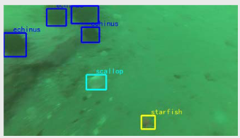

<h3 id="URPC2020DL">URPC2020DL</h3>

- 6575张训练，2400张测试，最高分辨率为3840x2160
- 测试集没有annotations

<h3 id="UDD">UDD</h3>

- 1827张训练，400张测试，最高分辨率为3840x2160

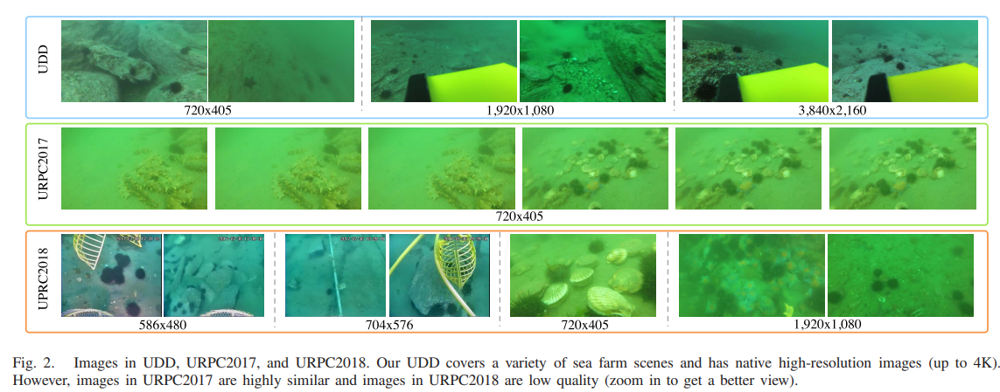

<h3 id="DUO">DUO</h3>

- 6641张训练，1111张测试，总的目标数有74515.

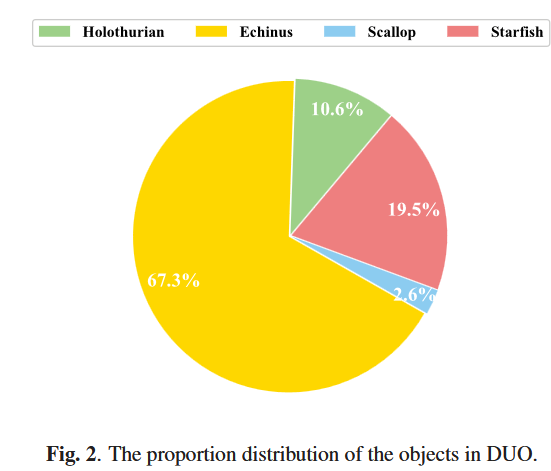

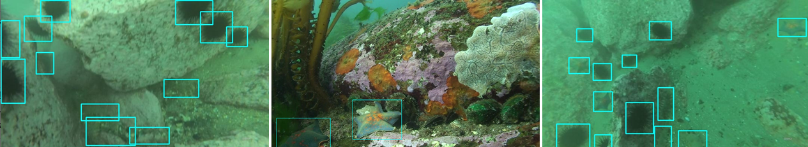

<h3 id="UODD">UODD</h3>

- 2560张训练，128张验证、506张测试
- Four classes: echinus, holothurian, scallop, starfish

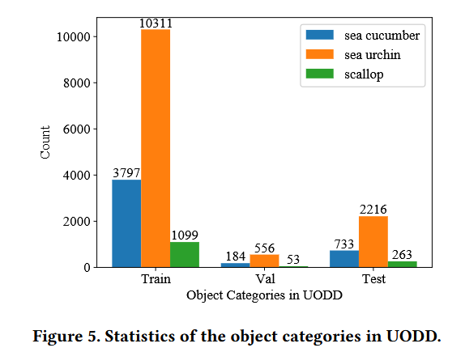

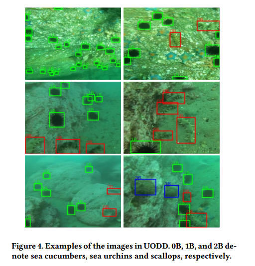

<h3 id="UTDAC2020">UTDAC2020</h3>

- 5168训练、1293验证
- 四种分辨率：3840×2160, 1920×1080,720×405,and 586×480.
- Four classes: echinus, holothurian, scallop, starfish

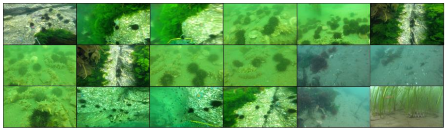

<h3 id="S_UTDAC2020">S_UTDAC2020</h3>

- Four classes: echinus, holothurian, scallop, starfish

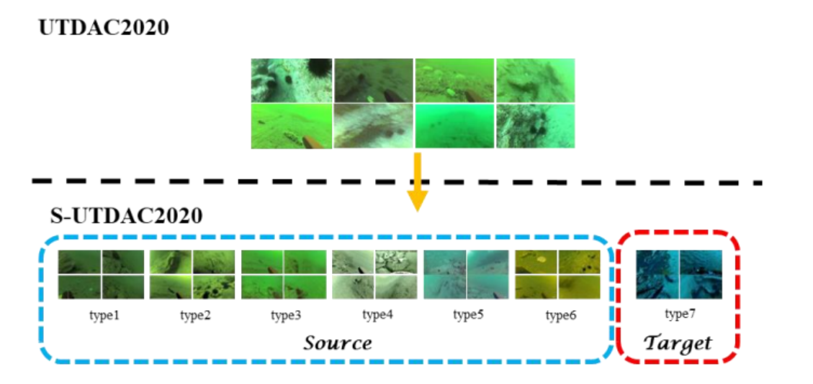

<h3 id="RUOD">RUOD</h3>

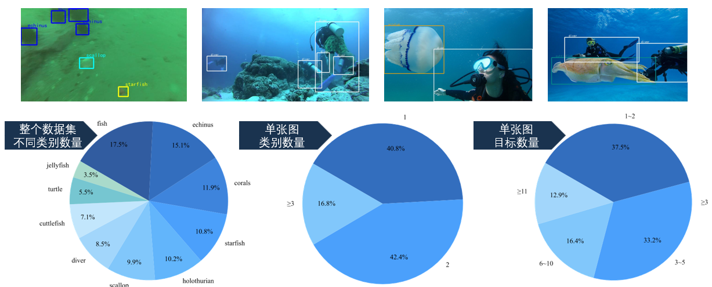

<h3 id="Fish4Knowledge">Fish4Knowledge</h3>

- fish4knowledge dataset for fish classification, including 23 categories and 20,000+ pictures

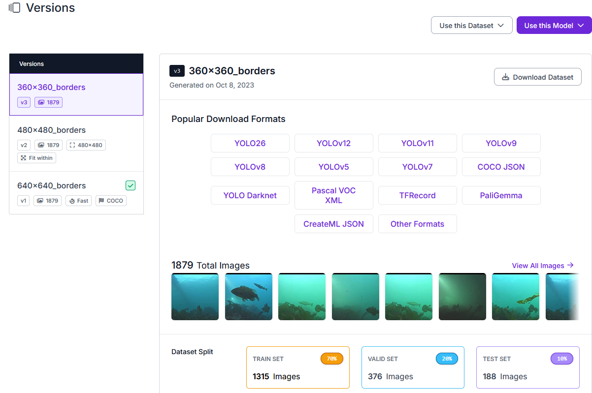

<h3 id="DDD">DDD</h3>

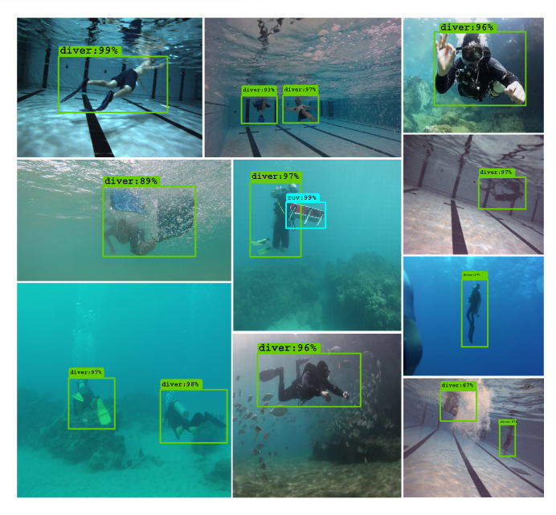

<h3 id="SUIM">SUIM</h3>

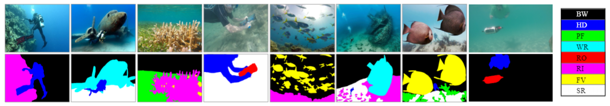

<h3 id="DUT-USEG">DUT-USEG</h3>

- includes 6617 images, 1487 of which have semantic segmentation and instance segmentation annotations, and the remaining 5130 images have object detection box annotations.

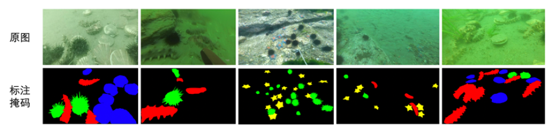

<h3 id="UIIS10K">UIIS10K</h3>

- includes **10,048 images** with pixel-level annotations for 10 categories.
-  **the largest underwater instance segmentation dataset**  available and can be used as a benchmark for evaluating underwater segmentation methods.

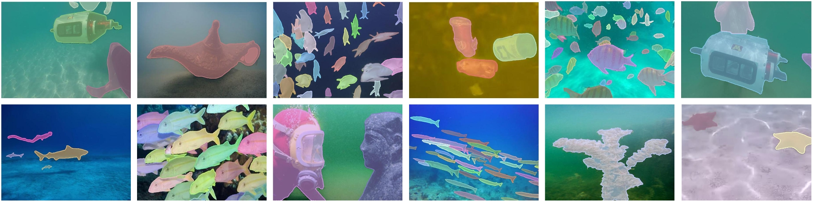

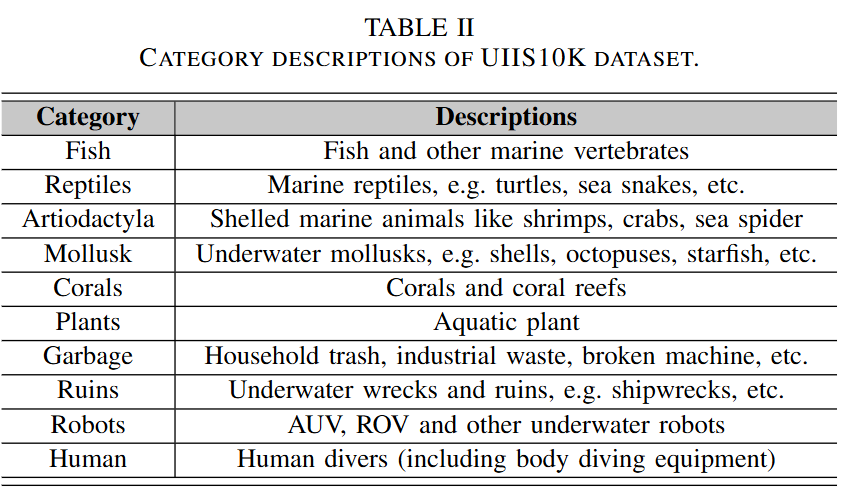

<h3 id="USIS10K">USIS10K</h3>

- contains **10,632** images and pixel-level annotations of **7 categories**
- the **largest salient instance segmentation dataset**  available that simultaneously includes Class-Agnostic and Multi-Class labels.

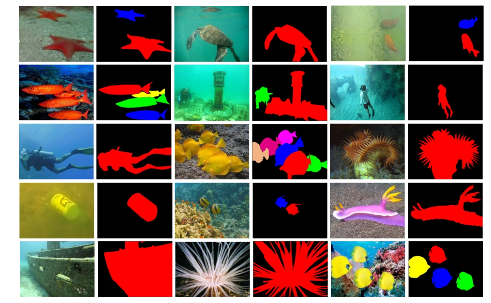

<h3 id="USIS16K">USIS16K</h3>

- a **High-Quality** large-scale dataset consisting of **16,151** high-resolution underwater images
- It encompasses **158** distinct categories of underwater objects.

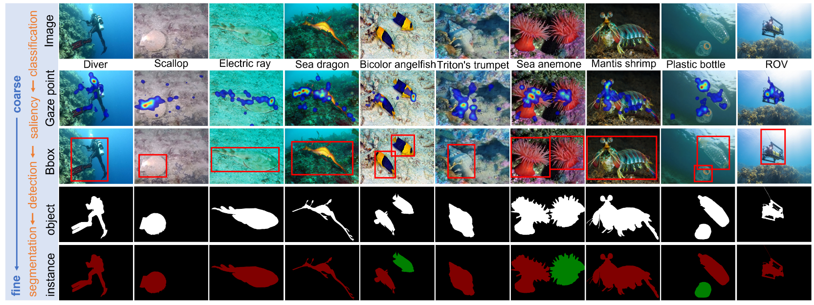

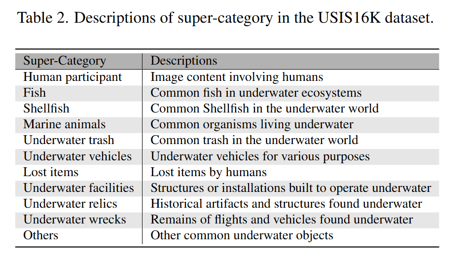

<h3 id="MAS3K">MAS3K</h3>

- the first open Marine Animal Segmentation dataset, called MAS3K
- contains a total of 3,103 images, where 1,588 are for camouflaged cases, 1,322 are for common cases, and 193 are underwater images in absence of marine animals
- cover both vertebrate and invertebrate, including seven super-classes, e.g., mammals, reptile, arthropod, and
  marine fish, etc. Under the super-classes, MAS3K dataset has 37 sub-classes,e.g., crab, starfish, shark, and turtle, etc.

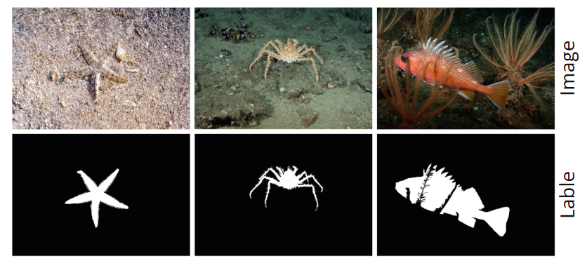

<h3 id="USOD">USOD</h3>

- A **test dataset** for underwater salient object detection (SOD).
-  contains 300 images (640 x 480)

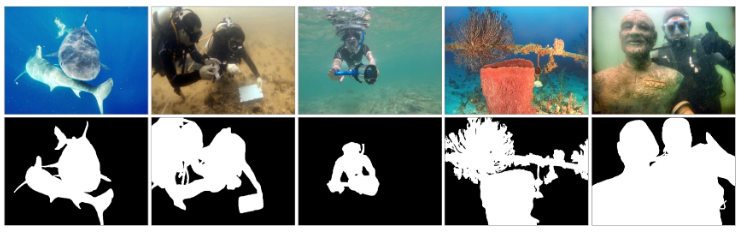

<h3 id="USOD10K">USOD10K</h3>

- It consists of 10,255 underwater images, covering 70 categories of salient objects in 12 different underwater scenes.

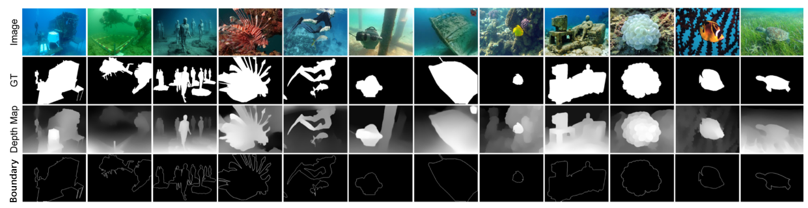

----

<h3 id="LIACI">LIACI</h3>

- 首个公开的用于水下船舶检查的大规模语义分割数据集，包含1893张带有像素注释的图像

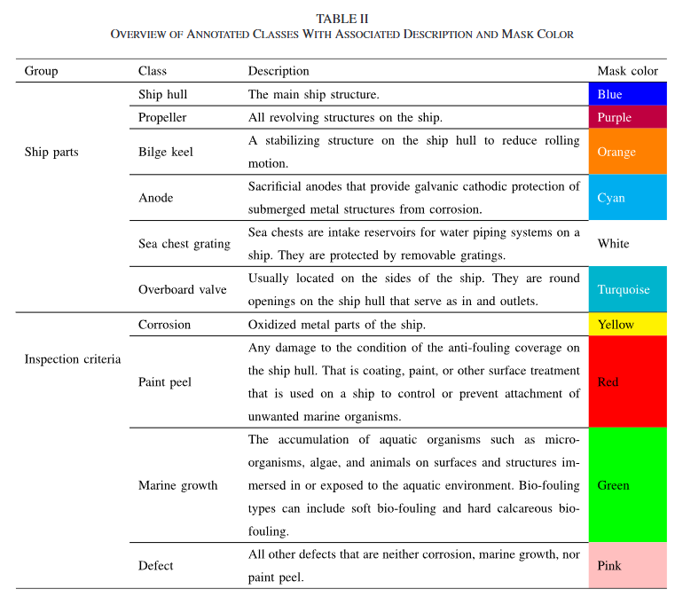

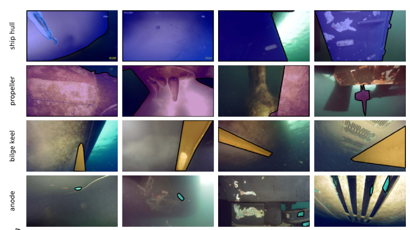

---

<h3 id="UIEBD">UIEBD</h3>

- 100 images

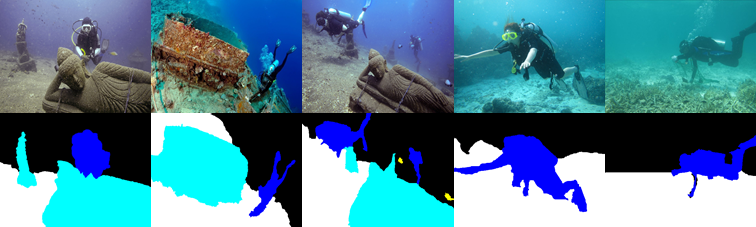

<h3 id="UFO-120">UFO-120</h3>

- **train_val/** contains 1500 paired samples for training/validation
- **TEST/** contains 120 paired samples for benchmark evaluation

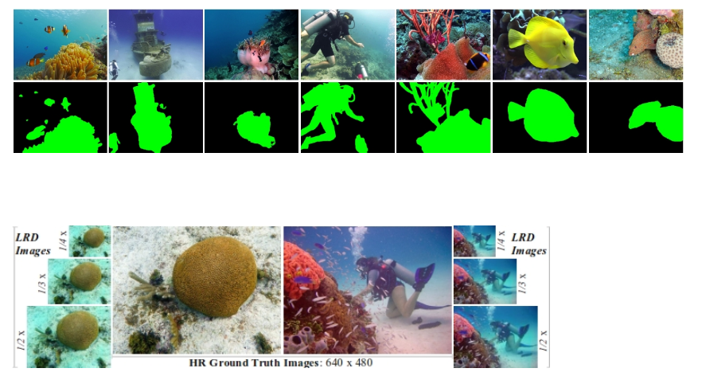

<h3 id="TrashCan">TrashCan</h3>

-  consists of **14424 images with 54285 labeled objects belonging to 22 different classes** including *rov*, *trash unknown instance*, *trash plastic*, and other: *trash metal*, *trash etc*, *animal fish*, *plant*, *trash wood*, *animal eel*, *animal etc*, *trash fabric*, *animal crab*, *trash branch*, *trash fishing gear*, *animal shells*, *animal starfish*, *trash paper*, *trash rubber*, *trash wreckage*, *trash rope*, *trash tarp*, and *trash net*

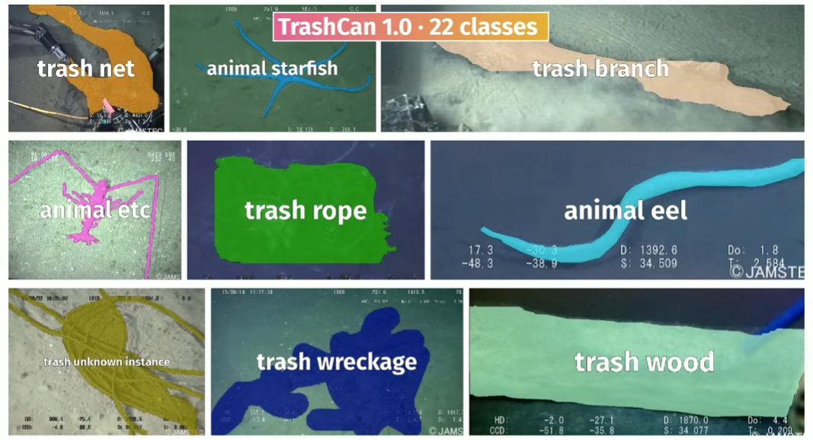

TrashCan

<h3 id="Sea-thru">Sea-thru</h3>

-  consists of the ~**1100 images, across 5 scenes**
- There are 5 datasets (D1-D5). Each dataset consists of 1) N linear images with no color correction, and 2) N depth maps corresponding to each image. N is different for each dataset, please see paper for details.

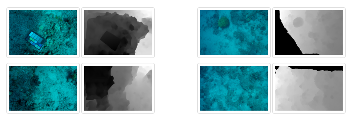

<h3 id="UWA-CIRset">UWA-CIRset</h3>

<h3 id="EUVP">EUVP</h3>

- The EUVP (Enhancing Underwater Visual Perception) dataset contains  separate sets of paired and unpaired image samples of poor and good  perceptual quality to facilitate supervised training of underwater image enhancement models. 

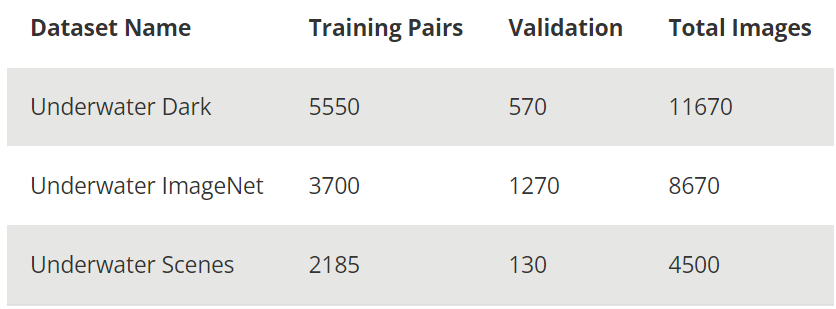

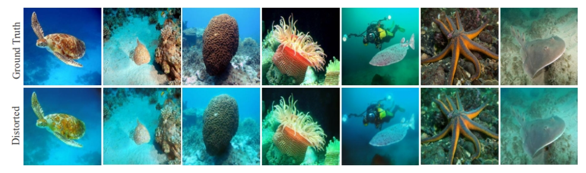

<h3 id="UIEB">UIEB</h3>

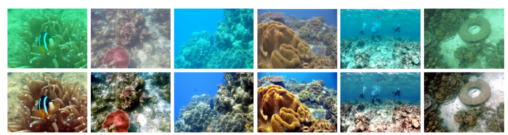

----

<h3 id="SUIM-E">SUIM-E</h3>

- The SUIM-E dataset is created by supplementing the **[SUIM]** dataset with the corresponding enhancement references.
- used 12 underwater image enhancement methods to generate candidate reference images

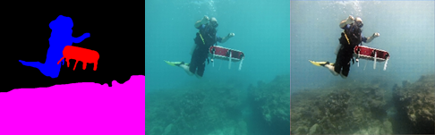

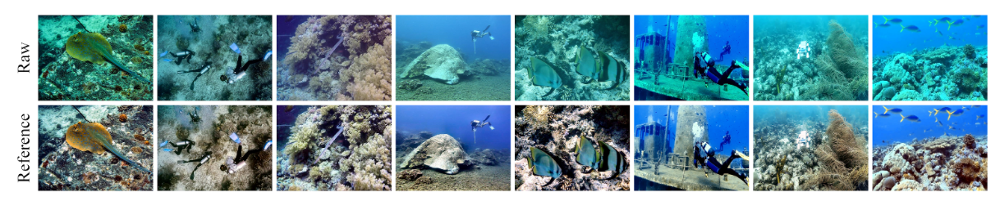

<h3 id="RUIE">RUIE</h3>

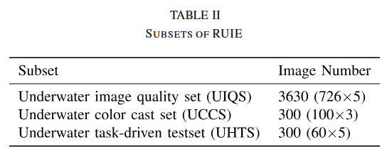

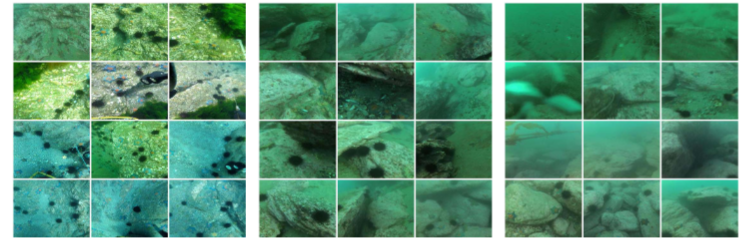

<h3 id="OceanDark">OceanDark</h3>

- 183张1280 x 720像素，由位于深海的摄像机使用人工照明拍摄

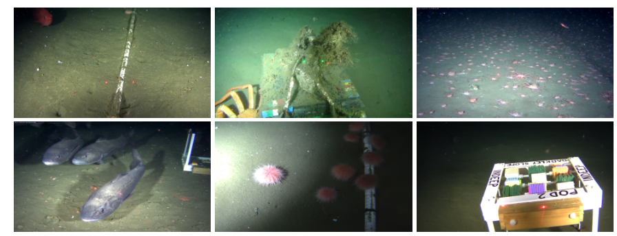

<h3 id="U-45">U-45</h3>

- 45 real underwater images

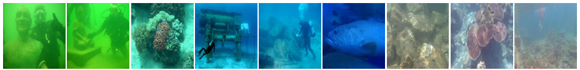

<h3 id="FLSeaVI">FLSeaVI</h3>

- There are 12 visual-inertial datasets and 4 stereo datasets. They were collected in the Mediterranean and Red Sea, on 8 dives

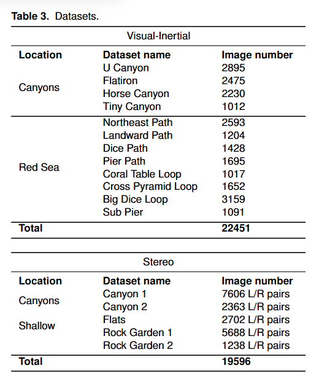

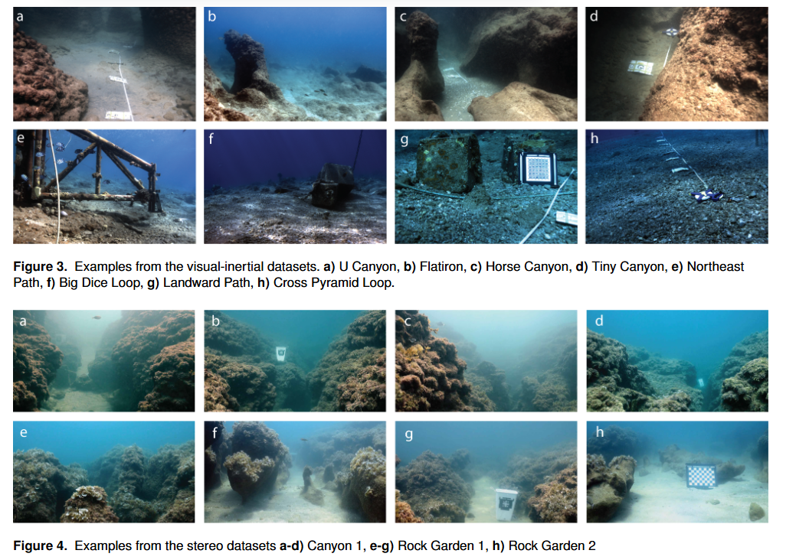

<h3 id="SQUID">SQUID</h3>

- The dataset includes RAW images, TIF files, camera clibration files, and distance maps.
- The database contains 57 stereo pairs from four different sites in Israel, two in the Red Sea (representing tropical water) and two in the Mediterranean Sea (temperate water). In the Red Sea the sites were a coral reef ('Katzaa') which is 10-15 meters deep (15 pairs) and a shipwreck ('Satil'), 20-30 meters deep (8 pairs). In the Mediterranean Sea both sites were rocky reef environments, separated by 30km, Nachsholim at 3-6 meters depth (13 pairs), and Mikhmoret at 10-12 meters depth (21 pairs).

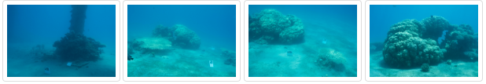

<h3 id="TURBID">TURBID</h3>

- TURBID consists in a collection of five different subsets of degraded images with its respective ground-truth.The subset Milk and DeepBlue has 20 images each and the subset Chlorophyll has 42 images.

 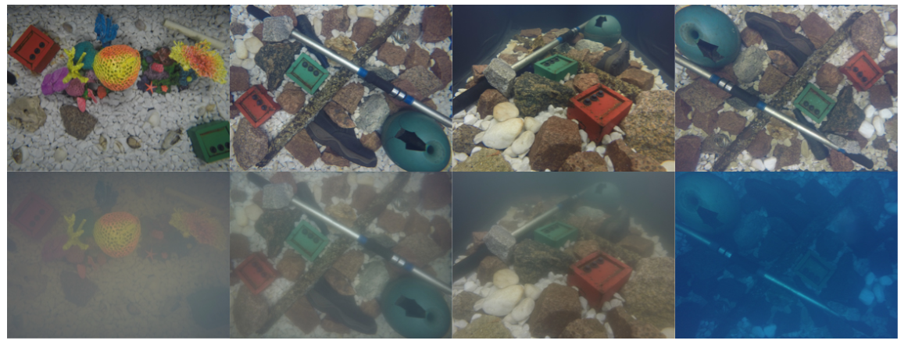

<h3 id="USR-248">USR-248</h3>

- 超分辨数据集

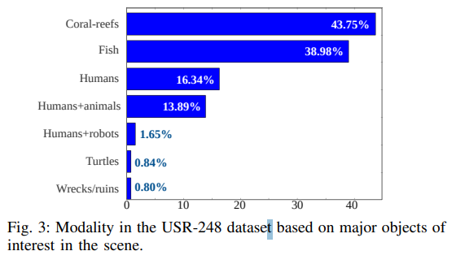

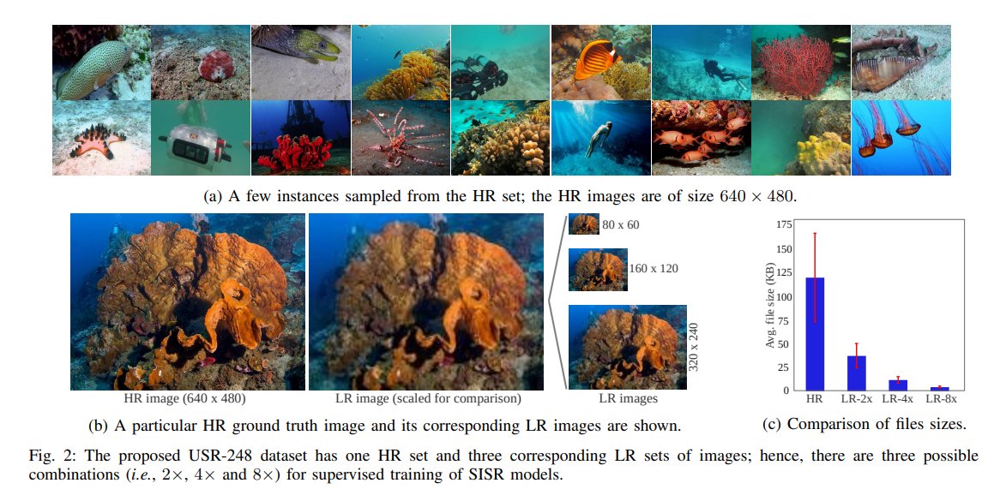

